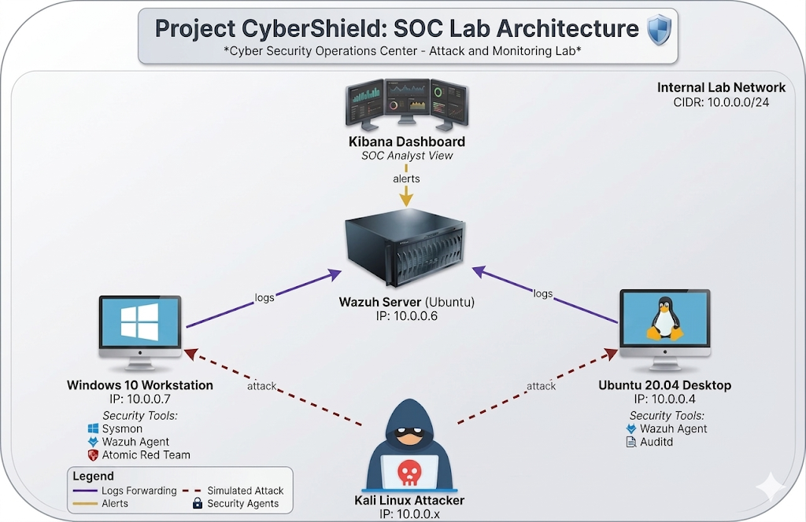

# 🛡️SOC Lab – Threat Detection & Simulation with Wazuh SIEM


> A hands-on Security Operations Center (SOC) lab environment built for threat detection, log analysis, and attack simulation using the MITRE ATT&CK framework.

---

## 📌 Project Overview

This project builds a small-scale SOC environment designed for hands-on practice and personal portfolio demonstration. The system integrates **Wazuh SIEM** to collect and analyze logs from multiple endpoints, combined with **Atomic Red Team** to simulate real-world attack techniques mapped to the MITRE ATT&CK framework.

### Objectives

- Deploy and configure Wazuh SIEM (all-in-one deployment)
- Collect logs from multiple sources: Windows Event Log, Sysmon, Linux Syslog/Auditd
- Build custom decoders and detection rules mapped to MITRE ATT&CK techniques
- Simulate real-world attack scenarios using Atomic Red Team across multiple tactics
- Evaluate detection rate and visualize security events on Kibana dashboard

### Technologies Used

| Component | Tool | Version |
|---|---|---|
| SIEM | Wazuh | 4.7.x |
| Indexer / Dashboard | Elastic Stack (Wazuh fork) | 4.7.x |
| Endpoint Monitoring | Sysmon | Latest |
| Attack Simulation | Atomic Red Team | Latest |
| Framework | MITRE ATT&CK | v14 |

---

## 🖧 Lab Architecture

```
                    ┌─────────────────────┐
                    │   Kibana Dashboard  │
                    │   SOC Analyst View  │
                    └──────────┬──────────┘
                               │ alerts
                    ┌──────────▼──────────┐
                    │    Wazuh Server     │
                    │   Ubuntu Server     │
                    │   IP: 10.0.0.6      │
                    └───┬─────────────┬───┘
               logs ◄───┘             └───► logs
    ┌──────────────────┐           ┌──────────────────┐
    │  Windows 10      │           │      Ubuntu      │
    │  IP: 10.0.0.7    │           │  IP: 10.0.0.4    │
    │  - Sysmon        │           │  - Wazuh Agent   │
    │  - Wazuh Agent   │           │  - Auditd        │
    │  - Atomic RT     │           │  - Atomic RT     │
    └────────▲─────────┘           └────────▲─────────┘
             │  attack (simulated)           │
             └──────────────┬───────────────┘
                   ┌────────┴────────┐
                   │  Kali Linux     │
                   │  IP: 10.0.0.x   │
                   │  (Attacker)     │
                   └─────────────────┘

Network: 10.0.0.0/24 (Internal Lab Network)
```


### VM Specifications

| VM | OS | IP | RAM | CPU | Role |
|---|---|---|---|---|---|
| Wazuh Server | Ubuntu 22.04 LTS | 10.0.0.6 | 4GB | 2 core | SIEM, Indexer, Dashboard |
| Windows Agent | Windows 10 | 10.0.0.7 | 4GB | 2 core | Endpoint (Sysmon + Atomic RT) |
| Linux Agent | Ubuntu 20.04 | 10.0.0.4 | 2GB | 2 core | Endpoint (Auditd + Atomic RT) |
| Kali Attacker | Kali Linux | 10.0.0.x | 4GB | 2 core | Attack simulation |

---

## 📂 Documentation

| Phase | Description | Status |
|---|---|---|
| [Phase 1 – Infrastructure](docs/phase1-infrastructure.md) | Deploy Wazuh Server, configure VMs | Completed |
| [Phase 2 – Agent & Log Collection](docs/phase2-agent-log-collection.md) | Install agents, configure log sources | Completed |
| [Phase 3 – Log Parsing](docs/phase3-log-parsing.md) | Write custom decoders | Completed |
| [Phase 4 – Detection Rules](docs/phase4-detection-rules.md) | Write MITRE-mapped detection rules | Completed |
| [Phase 5 – Atomic Simulation](docs/phase5-atomic-simulation.md) | Run Atomic Red Team tests | Completed |

---

## 📁 Repository Structure

```
mini-soc-lab/
├── README.md
├── docs/
│   ├── phase1-infrastructure.md
│   ├── phase2-agent-log-collection.md
│   ├── phase3-log-parsing.md
│   ├── phase4-detection-rules.md
│   └── phase5-atomic-simulation.md
├── configs/
│   ├── ossec.conf
│   ├── custom_decoders.xml
│   └── local_rules.xml
├── screenshots/
│   └── (per-phase screenshots)
└── atomic-tests/
    └── test-results.md
```

---

## 🎯 MITRE ATT&CK Coverage

| Tactic | Technique | Atomic Test | Detection Rule |
|---|---|---|---|
| Credential Access | T1003 – OS Credential Dumping | ✅ | ⏳ |
| Execution | T1059.001 – PowerShell | ✅ | ⏳ |
| Credential Access | T1110.001 – Password Brute Force | ✅ | ⏳ |
| Persistence | T1053.005 – Scheduled Task | ✅ | ⏳ |
| Defense Evasion | T1055 – Process Injection | ✅ | ⏳ |

---

## 👤 Author

**Huy** – Cybersecurity Student, Year 4  
Focus: SOC, SIEM, Threat Detection, Blue Team

---

*This project is for educational and portfolio purposes only. All attack simulations are performed in an isolated lab environment.*
