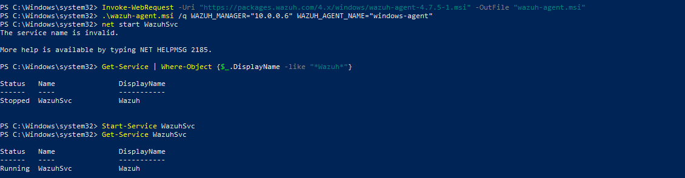

# Phase 1: Infrastructure Setup

## Overview

This phase covers deploying the Wazuh Server (all-in-one) and preparing all virtual machines in the lab environment.

---

## 1.1 VM Specifications

| VM | OS | IP | RAM | CPU | Disk |
|---|---|---|---|---|---|
| Wazuh Server | Ubuntu 22.04 LTS | 10.10.0.6 | 4GB | 2 core | 50GB |
| Windows Agent | Windows 10 | 10.10.0.7 | 4GB | 2 core | 50GB |
| Linux Agent | Ubuntu 20.04 | 10.10.0.4 | 2GB | 2 core | 30GB |
| Kali Attacker | Kali Linux | 10.10.0.x | 4GB | 2 core | 40GB |

**Network:** Create a single NAT Network `10.10.0.0/24` and attach all VMs to it. Verify connectivity:

```bash

## 1.2 Install Wazuh Server (All-in-One)

> Performed on: **Ubuntu 22.04 – 10.10.0.6**

### Step 1 – System update

```bash
sudo apt update && sudo apt upgrade -y
```

### Step 2 – Download installation files

```bash
curl -sO https://packages.wazuh.com/4.7/wazuh-install.sh
curl -sO https://packages.wazuh.com/4.7/config.yml
```

### Step 3 – Edit config.yml

```yaml
nodes:
  indexer:
    - name: node-1
      ip: "10.0.0.6"
  server:
    - name: wazuh-1
      ip: "10.0.0.6"
  dashboard:
    - name: dashboard
      ip: "10.0.0.6"
```

### Step 4 – Run installation

```bash
# Generate certificates
sudo bash wazuh-install.sh --generate-config-files

# Install Wazuh Indexer (Elasticsearch)
sudo bash wazuh-install.sh --wazuh-indexer node-1

# Install Wazuh Manager
sudo bash wazuh-install.sh --wazuh-server wazuh-1

# Install Wazuh Dashboard (Kibana)
sudo bash wazuh-install.sh --wazuh-dashboard dashboard
```


### Step 5 – Retrieve admin password

```bash
sudo tar -O -xvf wazuh-passwords.tar | grep -P "\'admin\'" -A 1
```

> ⚠️ Save this password — required to log in to the dashboard.

---

## 1.3 Verify Installation

```bash
# Check all services are running
sudo systemctl status wazuh-manager
sudo systemctl status wazuh-indexer
sudo systemctl status wazuh-dashboard


```
---

## 1.4 Access Dashboard

Open a browser and navigate to:

```
https://10.10.0.6
Username: admin
Password: OwSVJ+lplT*1hYwjbJurlmGogBxHuz1h
```

> Accept the SSL warning (self-signed certificate).

---

