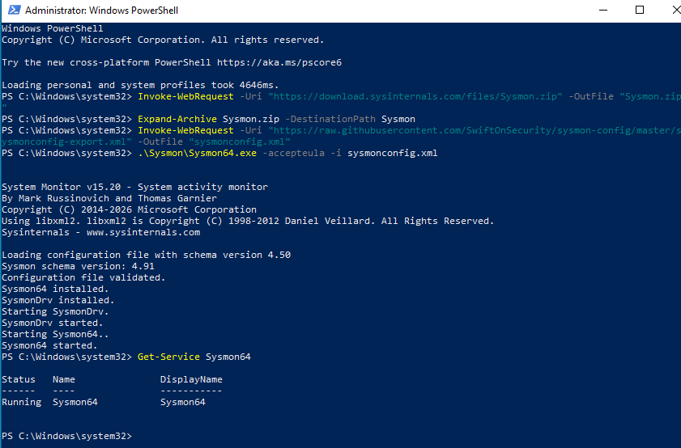
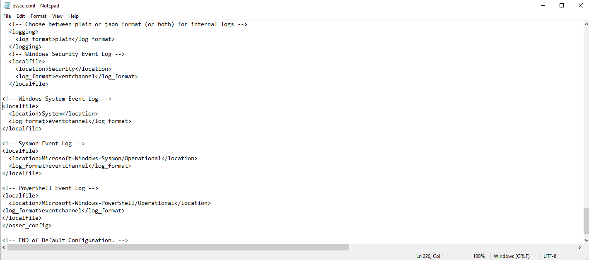
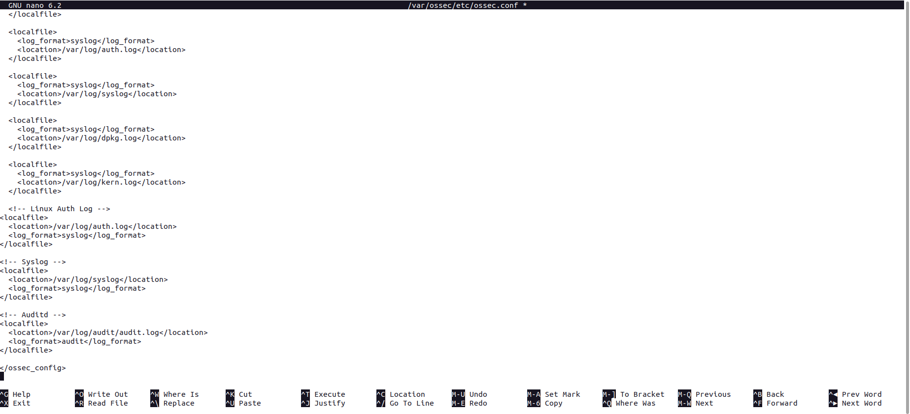
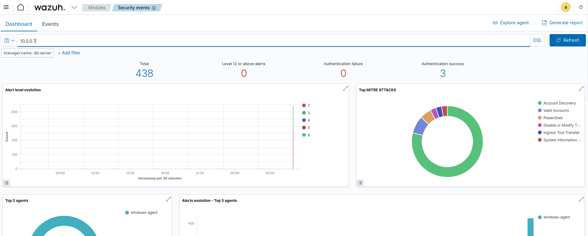
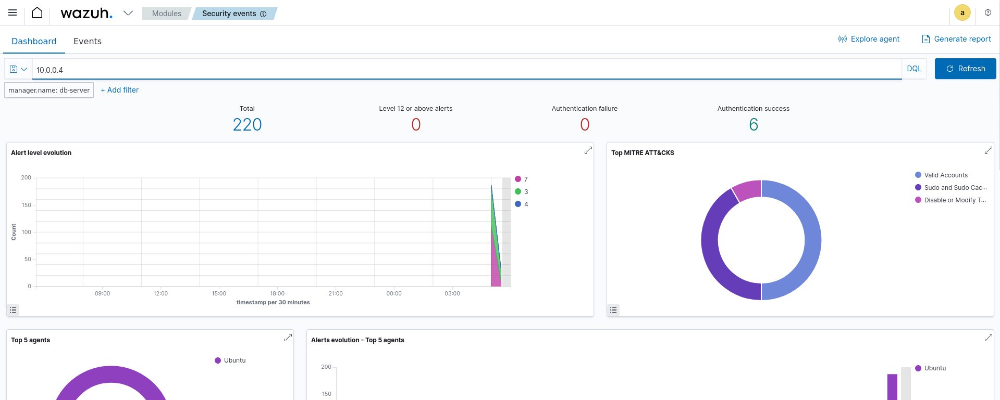

# Phase 2: Agent Installation & Log Collection

## Overview

This phase covers installing Wazuh agents on Windows and Linux endpoints, configuring log sources, and verifying data flow to the Wazuh SIEM.

---

## 2.1 Install Sysmon on Windows Agent

> Performed on: **Windows 10 – 10.0.0.7**

Sysmon must be installed **before** the Wazuh agent to ensure complete event logging from the start.

### Step 1 – Download Sysmon

```powershell
Invoke-WebRequest -Uri "https://download.sysinternals.com/files/Sysmon.zip" -OutFile "Sysmon.zip"
Expand-Archive Sysmon.zip -DestinationPath Sysmon
```

### Step 2 – Download SwiftOnSecurity config

```powershell
Invoke-WebRequest -Uri "https://raw.githubusercontent.com/SwiftOnSecurity/sysmon-config/master/sysmonconfig-export.xml" -OutFile "sysmonconfig.xml"
```

### Step 3 – Install Sysmon

```powershell
.\Sysmon\Sysmon64.exe -accepteula -i sysmonconfig.xml
```

### Step 4 – Verify

```powershell
Get-Service Sysmon64
```

Expected output:
```
Status   Name               DisplayName
------   ----               -----------
Running  Sysmon64           System Monitor
```

---

## 2.2 Install Wazuh Agent on Windows

> Performed on: **Windows 10 – 10.0.0.7**

### Step 1 – Download agent installer

```powershell
Invoke-WebRequest -Uri "https://packages.wazuh.com/4.x/windows/wazuh-agent-4.7.5-1.msi" -OutFile "wazuh-agent.msi"
```

### Step 2 – Install agent

```powershell
.\wazuh-agent.msi /q WAZUH_MANAGER="10.0.0.6" WAZUH_AGENT_NAME="windows-agent"
```

### Step 3 – Start agent service

```powershell
net start WazuhSvc
```

### Step 4 – Verify

```powershell
Get-Service WazuhSvc
```

Expected output:
```
Status   Name               DisplayName
------   ----               -----------
Running  WazuhSvc           Wazuh
```

---

## 2.3 Install Wazuh Agent on Linux

> Performed on: **Ubuntu 20.04 – 10.0.0.4**

### Step 1 – Add Wazuh repository

```bash
curl -s https://packages.wazuh.com/key/GPG-KEY-WAZUH | sudo gpg --no-default-keyring --keyring gnupg-ring:/usr/share/keyrings/wazuh.gpg --import
sudo chmod 644 /usr/share/keyrings/wazuh.gpg

echo "deb [signed-by=/usr/share/keyrings/wazuh.gpg] https://packages.wazuh.com/4.x/apt/ stable main" | sudo tee /etc/apt/sources.list.d/wazuh.list

sudo apt update
```

### Step 2 – Install agent

```bash
sudo WAZUH_MANAGER="10.0.0.6" WAZUH_AGENT_NAME="linux-agent" apt install wazuh-agent -y
```

### Step 3 – Start agent service

```bash
sudo systemctl daemon-reload
sudo systemctl enable wazuh-agent
sudo systemctl start wazuh-agent
```
### Step 4 – Verify

```bash
sudo systemctl status wazuh-agent
```

---

## 2.4 Configure Log Sources

### Windows – ossec.conf

Edit `C:\Program Files (x86)\ossec-agent\ossec.conf`, add the following inside `<ossec_config>`:

```xml
<!-- Windows Security Event Log -->
<localfile>
  <location>Security</location>
  <log_format>eventchannel</log_format>
</localfile>

<!-- Windows System Event Log -->
<localfile>
  <location>System</location>
  <log_format>eventchannel</log_format>
</localfile>

<!-- Sysmon Event Log -->
<localfile>
  <location>Microsoft-Windows-Sysmon/Operational</location>
  <log_format>eventchannel</log_format>
</localfile>

<!-- PowerShell Event Log -->
<localfile>
  <location>Microsoft-Windows-PowerShell/Operational</location>
  <log_format>eventchannel</log_format>
</localfile>
```

Restart agent after editing:
```bash
net stop WazuhSvc
net start WazuhSvc
```

### Linux – ossec.conf

Edit `/var/ossec/etc/ossec.conf`, add inside `<ossec_config>`:

```xml
<!-- Linux Auth Log -->
<localfile>
  <location>/var/log/auth.log</location>
  <log_format>syslog</log_format>
</localfile>

<!-- Syslog -->
<localfile>
  <location>/var/log/syslog</location>
  <log_format>syslog</log_format>
</localfile>

<!-- Auditd -->
<localfile>
  <location>/var/log/audit/audit.log</location>
  <log_format>audit</log_format>
</localfile>
```

Enable and start Auditd:
```bash
sudo apt install auditd -y
sudo systemctl enable auditd
sudo systemctl start auditd
```

Restart agent:
```bash
sudo systemctl restart wazuh-agent
```

---

## 2.5 Verify Agents on Dashboard

1. Open browser → `https://10.0.0.6`
2. Navigate to **Agents** section
3. Both agents should appear with status **Active**

| Agent Name | IP | OS | Status |
|---|---|---|---|
| windows-agent | 10.0.0.7 | Windows 10 | Active |
| linux-agent | 10.0.0.4 | Ubuntu 20.04 | Active |

Verify logs are flowing:
- Go to **Security Events** → filter by agent
- Confirm events are being received from both endpoints


---

