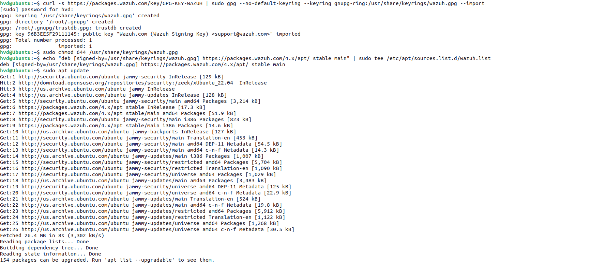
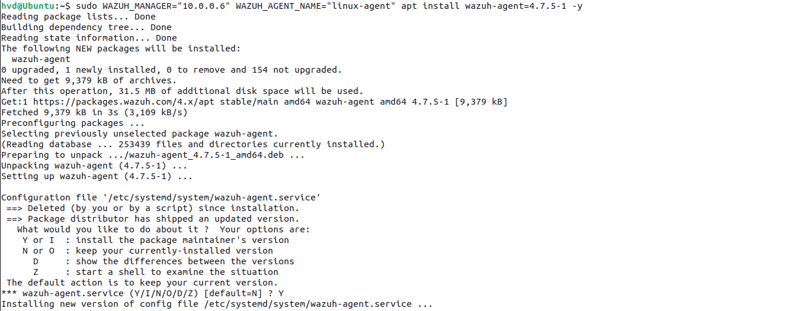
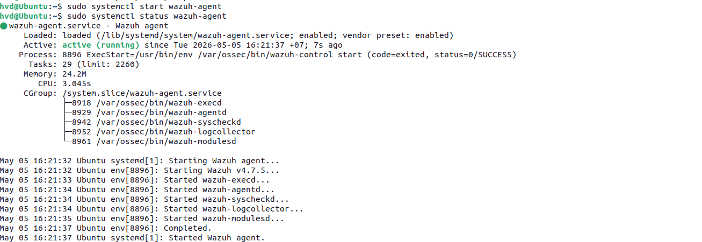

# Phase 3: Log Parsing & Custom Decoders

## Overview

This phase covers understanding Wazuh's log parsing pipeline, verifying built-in decoders, writing a custom decoder for PowerShell encoded commands, and testing using `wazuh-logtest`.

---

## 3.1 Wazuh Log Parsing Pipeline

When a log arrives at Wazuh, it goes through 3 phases:

```
Raw Log → Pre-decoding → Decoding → Rule Matching → Alert
```

| Phase | Description |
|---|---|
| **Pre-decoding** | Extracts timestamp, hostname, program_name |
| **Decoding** | Uses decoders (regex) to extract fields: srcip, user, port... |
| **Rule matching** | Compares decoded fields against rules to generate alerts |

> Without a decoder, Wazuh only sees raw text and cannot extract meaningful fields for rule matching.

### Key files

| File | Purpose |
|---|---|
| `/var/ossec/ruleset/decoders/` | Built-in decoders (read-only) |
| `/var/ossec/etc/decoders/local_decoder.xml` | Custom decoders (user-defined) |
| `/var/ossec/etc/rules/local_rules.xml` | Custom rules |

---

## 3.2 Verify Built-in SSH Decoder

Before writing custom decoders, check if Wazuh already has one for the log type.

```bash
# Search for SSH-related decoders
grep -r "Failed password" /var/ossec/ruleset/decoders/
```


Wazuh has a built-in SSH decoder at `/var/ossec/ruleset/decoders/0310-ssh_decoders.xml`:

```xml
<decoder name="sshd">
  <program_name>^sshd</program_name>
</decoder>

<decoder name="sshd-failed">
  <parent>sshd</parent>
  <prematch>Failed password</prematch>
  <regex>Failed password for (invalid user |illegal user )?(\S+) from (\S+) port (\S+)</regex>
  <order>extra_data, srcuser, srcip, srcport</order>
</decoder>
```

---

## 3.3 Test Built-in Decoder with wazuh-logtest

### Step 1 – Generate a real SSH failed login

From Kali attacker:
```bash
ssh wronguser@10.0.0.6
# Enter wrong password when prompted
```

### Step 2 – Retrieve the real log

On Wazuh Server:
```bash
sudo tail -5 /var/log/auth.log
```

Sample output:
```
May  5 11:33:01 db-server sshd[110445]: Failed password for invalid user wronguser from 10.0.0.3 port 33564 ssh2
```

### Step 3 – Test with wazuh-logtest

```bash
sudo /var/ossec/bin/wazuh-logtest
```

Paste the real log line. Expected output:

```
**Phase 1: Completed pre-decoding.
        full event: 'May  5 11:33:01 db-server sshd[110445]: Failed password for invalid user wronguser from 10.0.0.3 port 33564 ssh2'
        timestamp: 'May  5 11:33:01'
        hostname: 'db-server'
        program_name: 'sshd'

**Phase 2: Completed decoding.
        name: 'sshd'
        parent: 'sshd'
        srcip: '10.0.0.3'
        srcuser: 'wronguser'

**Phase 3: Completed filtering (rules).
        id: '5710'
        level: '5'
        description: 'sshd: Attempt to login using a non-existent user'
        groups: '['syslog', 'sshd', 'authentication_failed', 'invalid_login']'
        firedtimes: '1'
        gdpr: '['IV_35.7.d', 'IV_32.2']'
        gpg13: '['7.1']'
        hipaa: '['164.312.b']'
        mail: 'False'
        mitre.id: '['T1110.001', 'T1021.004']'
        mitre.tactic: '['Credential Access', 'Lateral Movement']'
        mitre.technique: '['Password Guessing', 'SSH']'
        nist_800_53: '['AU.14', 'AC.7', 'AU.6']'
        pci_dss: '['10.2.4', '10.2.5', '10.6.1']'
        tsc: '['CC6.1', 'CC6.8', 'CC7.2', 'CC7.3']'


**Alert to be generated.
```



> Built-in SSH decoder correctly extracts `srcip` and `srcuser` — no custom decoder needed for SSH.

Exit logtest: `Ctrl+C`

---

## 3.4 Write Custom Decoder – PowerShell Encoded Command

Built-in decoders do not cover PowerShell encoded command detection. We write a custom decoder for this.

### Target log (Sysmon Event ID 1):
```
CommandLine: powershell.exe -EncodedCommand dABlAHMAdAA=
```

### Edit local_decoder.xml

```bash
sudo nano /var/ossec/etc/decoders/local_decoder.xml
```

Add the following before the closing tag:

```xml
<!-- Custom decoder: PowerShell Encoded Command -->
<decoder name="custom-powershell-encoded">
  <program_name>Microsoft-Windows-Sysmon</program_name>
  <prematch>-EncodedCommand</prematch>
</decoder>

<decoder name="custom-powershell-encoded-fields">
  <parent>custom-powershell-encoded</parent>
  <regex>CommandLine: (\S+) -EncodedCommand (\S+)</regex>
  <order>process, encoded_command</order>
</decoder>
```



### Apply changes

```bash
sudo systemctl restart wazuh-manager

# Verify no errors
sudo tail -20 /var/ossec/logs/ossec.log | grep -i error
```
