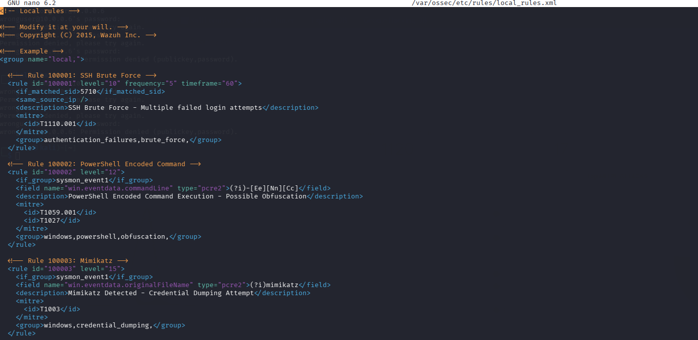
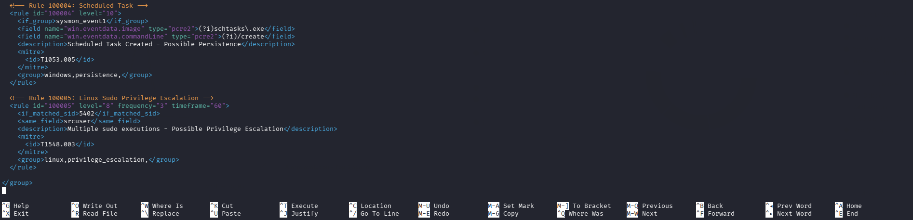
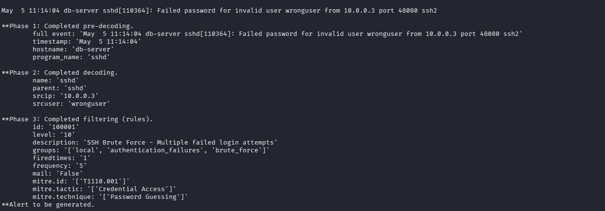

# Phase 4: Detection Rules & MITRE Mapping

## Overview

This phase covers writing custom Wazuh detection rules, mapping them to MITRE ATT&CK techniques, and testing using `wazuh-logtest`.

---

## 4.1 Wazuh Rule Syntax

Rules are defined in XML format. Custom rules go in `/var/ossec/etc/rules/local_rules.xml`.

```xml
<rule id="XXXXXX" level="X">
  <if_sid>PARENT_RULE_ID</if_sid>         <!-- trigger if parent rule fires -->
  <field name="FIELD">VALUE</field>        <!-- match on decoded field -->
  <description>Alert description</description>
  <mitre>
    <id>TXXXX</id>
  </mitre>
  <group>custom,groupname,</group>
</rule>
```

### Rule ID ranges

| Range | Purpose |
|---|---|
| 1 – 99999 | Built-in Wazuh rules |
| 100000 – 109999 | Custom rules (user-defined) |

### Rule levels

| Level | Meaning |
|---|---|
| 0 – 3 | Informational |
| 4 – 7 | Low severity |
| 8 – 11 | Medium severity |
| 12 – 15 | High severity / Critical |

---

## 4.2 Rule: SSH Brute Force Detection

Trigger when the same source IP fails SSH login 5+ times in 60 seconds.

```xml
<rule id="100001" level="10" frequency="5" timeframe="60">
  <if_matched_sid>5710</if_matched_sid>
  <same_source_ip />
  <description>SSH Brute Force - Multiple failed login attempts</description>
  <mitre>
    <id>T1110.001</id>
  </mitre>
  <group>authentication_failures,brute_force,</group>
</rule>
```

> `if_matched_sid: 5710` — built-in rule for SSH failed login (from Phase 3)
> `frequency: 5` — triggers after 5 matches
> `timeframe: 60` — within 60 seconds
> `same_source_ip` — must be from same IP

---

## 4.3 Rule: PowerShell Encoded Command

Trigger when PowerShell is executed with an encoded command (evasion technique).

```xml
<rule id="100002" level="12">
  <if_group>sysmon_event1</if_group>
  <field name="win.eventdata.commandLine" type="pcre2">(?i)-[Ee][Nn][Cc]</field>
  <description>PowerShell Encoded Command Execution - Possible Obfuscation</description>
  <mitre>
    <id>T1059.001</id>
    <id>T1027</id>
  </mitre>
  <group>windows,powershell,obfuscation,</group>
</rule>
```

---

## 4.4 Rule: Mimikatz / Credential Dumping

Trigger when known credential dumping tools are detected via Sysmon.

```xml
<rule id="100003" level="15">
  <if_group>sysmon_event1</if_group>
  <field name="win.eventdata.originalFileName" type="pcre2">(?i)mimikatz</field>
  <description>Mimikatz Detected - Credential Dumping Attempt</description>
  <mitre>
    <id>T1003</id>
  </mitre>
  <group>windows,credential_dumping,</group>
</rule>
```

---

## 4.5 Rule: Suspicious Scheduled Task Creation

Trigger when a new scheduled task is created (common persistence technique).

```xml
<rule id="100004" level="10">
  <if_group>sysmon_event1</if_group>
  <field name="win.eventdata.image" type="pcre2">(?i)schtasks\.exe</field>
  <field name="win.eventdata.commandLine" type="pcre2">(?i)/create</field>
  <description>Scheduled Task Created - Possible Persistence</description>
  <mitre>
    <id>T1053.005</id>
  </mitre>
  <group>windows,persistence,</group>
</rule>
```

---

## 4.6 Rule: Linux Privilege Escalation via Sudo

Trigger when a non-standard user runs sudo commands repeatedly.

```xml
<rule id="100005" level="8" frequency="3" timeframe="60">
  <if_matched_sid>5402</if_matched_sid>
  <same_source_user />
  <description>Multiple sudo executions - Possible Privilege Escalation</description>
  <mitre>
    <id>T1548.003</id>
  </mitre>
  <group>linux,privilege_escalation,</group>
</rule>
```

---

## 4.7 Apply Rules

### Step 1 – Edit local_rules.xml

```bash
sudo nano /var/ossec/etc/rules/local_rules.xml
```

Add all rules inside the `<group name="local,">` tag:

```xml
<group name="local,">

  <!-- Rule 100001: SSH Brute Force -->
  <rule id="100001" level="10" frequency="5" timeframe="60">
    <if_matched_sid>5710</if_matched_sid>
    <same_source_ip />
    <description>SSH Brute Force - Multiple failed login attempts</description>
    <mitre>
      <id>T1110.001</id>
    </mitre>
    <group>authentication_failures,brute_force,</group>
  </rule>

  <!-- Rule 100002: PowerShell Encoded Command -->
  <rule id="100002" level="12">
    <if_group>sysmon_event1</if_group>
    <field name="win.eventdata.commandLine" type="pcre2">(?i)-[Ee][Nn][Cc]</field>
    <description>PowerShell Encoded Command Execution - Possible Obfuscation</description>
    <mitre>
      <id>T1059.001</id>
      <id>T1027</id>
    </mitre>
    <group>windows,powershell,obfuscation,</group>
  </rule>

  <!-- Rule 100003: Mimikatz -->
  <rule id="100003" level="15">
    <if_group>sysmon_event1</if_group>
    <field name="win.eventdata.originalFileName" type="pcre2">(?i)mimikatz</field>
    <description>Mimikatz Detected - Credential Dumping Attempt</description>
    <mitre>
      <id>T1003</id>
    </mitre>
    <group>windows,credential_dumping,</group>
  </rule>

  <!-- Rule 100004: Scheduled Task -->
  <rule id="100004" level="10">
    <if_group>sysmon_event1</if_group>
    <field name="win.eventdata.image" type="pcre2">(?i)schtasks\.exe</field>
    <field name="win.eventdata.commandLine" type="pcre2">(?i)/create</field>
    <description>Scheduled Task Created - Possible Persistence</description>
    <mitre>
      <id>T1053.005</id>
    </mitre>
    <group>windows,persistence,</group>
  </rule>

  <!-- Rule 100005: Linux Sudo Privilege Escalation -->
  <rule id="100005" level="8" frequency="3" timeframe="60">
    <if_matched_sid>5402</if_matched_sid>
    <same_source_user />
    <description>Multiple sudo executions - Possible Privilege Escalation</description>
    <mitre>
      <id>T1548.003</id>
    </mitre>
    <group>linux,privilege_escalation,</group>
  </rule>

</group>
```


### Step 2 – Reload rules

```bash
sudo systemctl restart wazuh-manager
```

---

## 4.8 Test Rules with wazuh-logtest

### Test Rule 100001 – SSH Brute Force

```bash
sudo /var/ossec/bin/wazuh-logtest
```

Paste this log 5+ times:
```
May  5 11:14:04 db-server sshd[110364]: Failed password for invalid user wronguser from 10.0.0.3 port 48080 ssh2
```

Expected: Rule `100001` fires after 5th attempt.

---

## 4.9 MITRE ATT&CK Coverage Summary

| Rule ID | Description | MITRE Technique | Tactic |
|---|---|---|---|
| 100001 | SSH Brute Force | T1110.001 | Credential Access |
| 100002 | PowerShell Encoded Command | T1059.001, T1027 | Execution, Defense Evasion |
| 100003 | Mimikatz / Credential Dumping | T1003 | Credential Access |
| 100004 | Scheduled Task Persistence | T1053.005 | Persistence |
| 100005 | Linux Sudo Escalation | T1548.003 | Privilege Escalation |

