# Phase 5: Atomic Red Team Simulation

## Overview

This phase covers installing Atomic Red Team on Windows and Linux endpoints, running attack simulations mapped to MITRE ATT&CK techniques, and verifying detection in Wazuh Dashboard.

---

## 5.1 Install Atomic Red Team on Windows

> Performed on: **Windows 10 – 10.0.0.7**

### Step 1 – Set execution policy

```powershell
Set-ExecutionPolicy Bypass -Scope CurrentUser -Force
```

### Step 2 – Install Invoke-AtomicRedTeam module

```powershell
IEX (IWR 'https://raw.githubusercontent.com/redcanaryco/invoke-atomicredteam/master/install-atomicredteam.ps1' -UseBasicParsing)
Install-AtomicRedTeam -getAtomics -Force
```

### Step 3 – Import module

```powershell
Import-Module "C:\AtomicRedTeam\invoke-atomicredteam\Invoke-AtomicRedTeam.psd1" -Force
```

### Step 4 – Verify

```powershell
Invoke-AtomicTest T1003 -ShowDetailsBrief
```
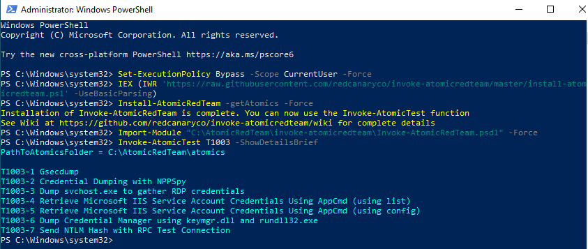
---

## 5.2 Install Atomic Red Team on Linux

> Performed on: **Ubuntu 20.04 – 10.0.0.4**

### Step 1 – Install dependencies

```bash
sudo apt install ruby ruby-dev -y
```
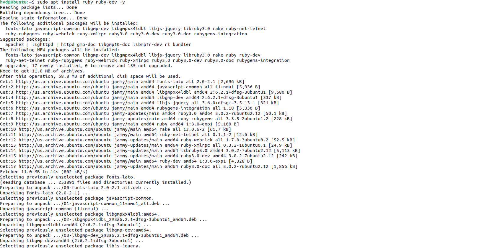
### Step 2 – Clone Atomic Red Team

```bash
cd ~
git clone https://github.com/redcanaryco/atomic-red-team.git
```
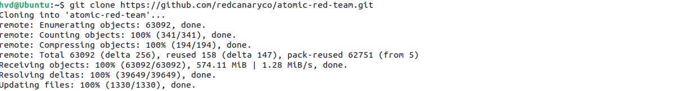
---

## 5.3 Attack Simulations

### Simulation 1 – T1110.001: Password Guessing (SSH Brute Force)

> Performed on: **Kali Linux**

```bash
# Brute force SSH using hydra
hydra -l root -P /usr/share/wordlists/rockyou.txt ssh://10.0.0.4 -t 4 -V
```
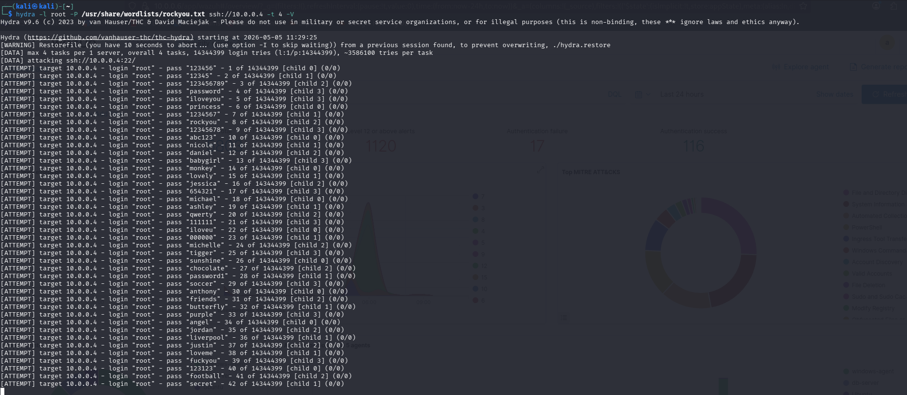

**Wazuh detection:**
- Decoder: `sshd`
- Rule: `5710` → `5763` (built-in brute force rule, level 10)
- MITRE: T1110.001 – Password Guessing

> Rule `5763` fires when Wazuh detects multiple failed SSH logins from the same source IP within a short timeframe.

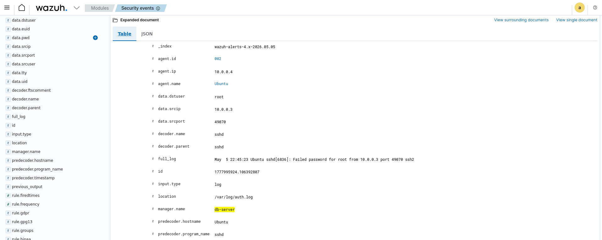
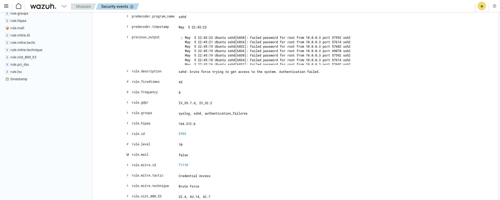
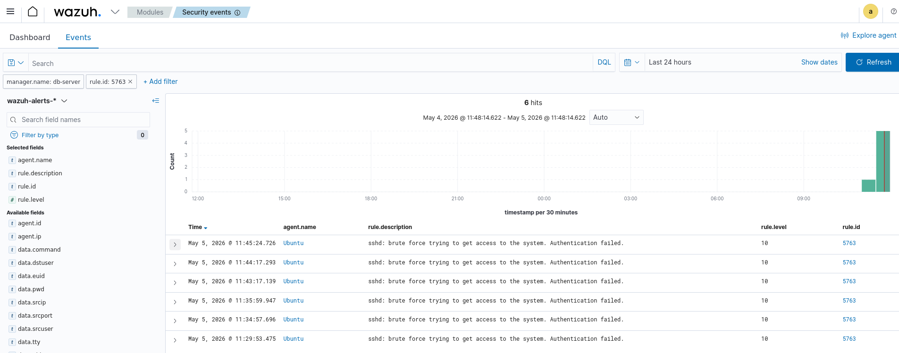

---

### Simulation 2 – T1059.001: PowerShell Execution

> Performed on: **Windows 10**

```powershell
Invoke-AtomicTest T1059.001 -TestNumbers 17
```
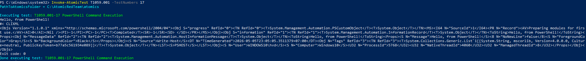
**Wazuh detection:**
- Rule 92057 – Powershell.exe spawned a powershell process which executed a base64 encoded command (Level 12)
- Rule 92213 – Executable file dropped in folder commonly used by malware (Level 15)
- Rule 92027 – Powershell process spawned powershell instance
- MITRE: T1059.001 – PowerShell
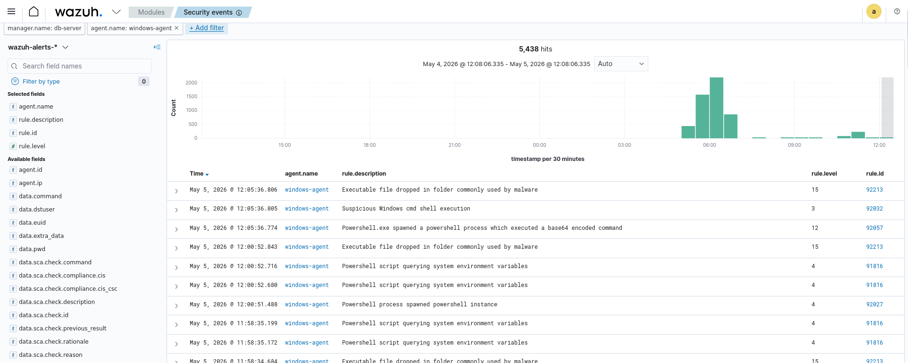

---

### Simulation 3 – T1053.005: Scheduled Task Persistence

> Performed on: **Windows 10**

```powershell
Invoke-AtomicTest T1053.005 -TestNumbers 1
```
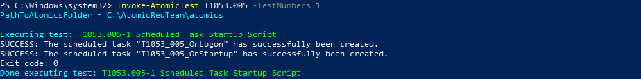
**Expected alert:** Rule `100004` – Scheduled Task Created (Level 10)
**MITRE:** T1053.005 – Scheduled Task/Job
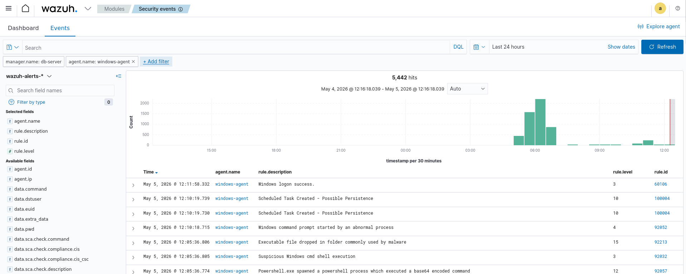

---

### Simulation 4 – T1003: Credential Dumping

> Performed on: **Windows 10**

```powershell
Invoke-AtomicTest T1003.001 -TestNumbers 1
```

**Expected alert:** Rule `100003` – Mimikatz / Credential Dumping (Level 15)
**MITRE:** T1003 – OS Credential Dumping

---

### Simulation 5 – T1087: Account Discovery

> Performed on: **Windows 10**

```powershell
for ($i=1; $i -le 5; $i++) { net user }
```
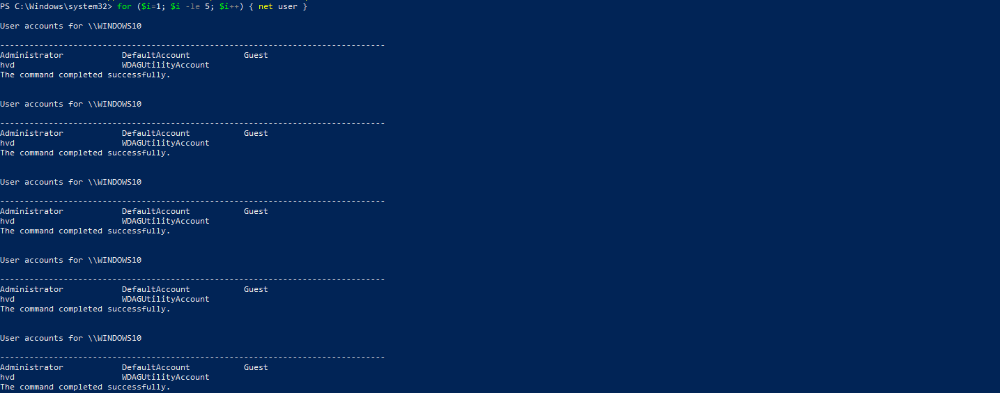
**Simulation 5 – Account Discovery**
- Technique: T1087
- Method: Manual command execution
- Commands used:
    - net user
- Result:
    - Wazuh detected discovery activity
    - Rule IDs: 92031, 92033
    - Alert level: 3
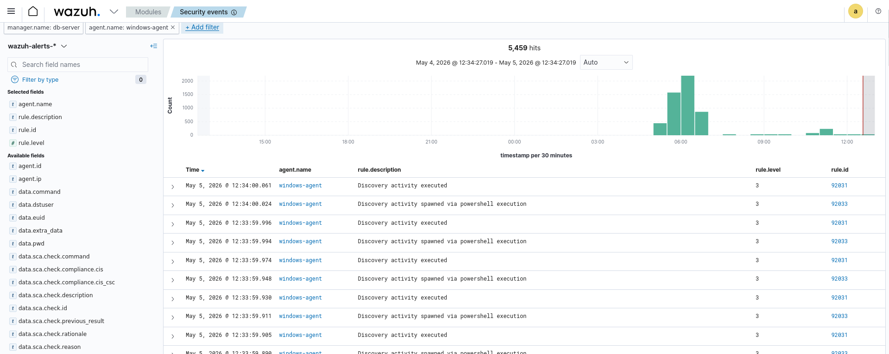
---

### Simulation 6 – T1548.003: Sudo Privilege Escalation

> Performed on: **Ubuntu 20.04**

```bash
# Run multiple sudo commands rapidly
for i in {1..5}; do sudo whoami; done

# Check log Ubuntu
sudo cat /var/log/auth.log | grep sudo
```
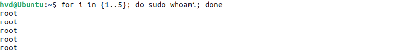
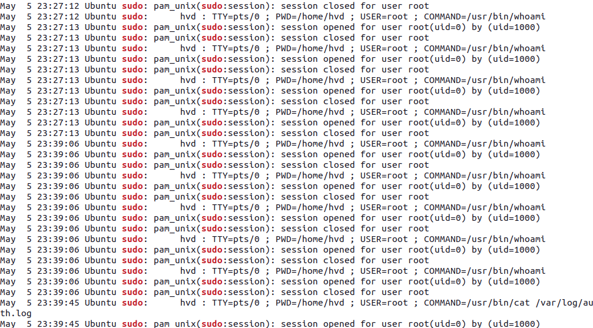

**Simulation 6 – Sudo Privilege Escalation**
- Technique: T1548.003
- Commands:
    - sudo whoami (multiple times)
- Result:
    - Logs recorded in /var/log/auth.log
    - Wazuh detected successful privilege escalation
    - Alert: Successful sudo to ROOT executed
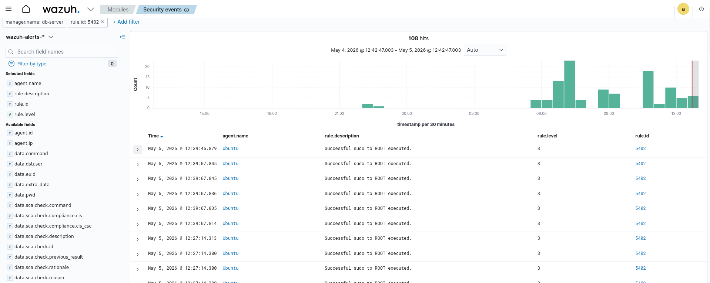
---

## 5.4 Cleanup After Simulation

After each test, clean up artifacts to keep the environment clean:

```powershell
# Windows – cleanup specific technique
Invoke-AtomicTest T1053.005 -Cleanup
Invoke-AtomicTest T1059.001 -Cleanup

# Cleanup all
Invoke-AtomicTest All -Cleanup
```

> ⚠️ Running `Invoke-AtomicTest All -Cleanup` may trigger a system restart.

---

## 5.5 Verify Detections on Dashboard

1. Open `https://10.0.0.6`
2. Navigate to **Security Events** → **MITRE ATT&CK**
3. Filter by time range covering the simulation period
4. Verify each technique appears in the dashboard

### Expected results

| Simulation | MITRE Technique | Wazuh Rule | Level | Detected |
|---|---|---|---|---|
| SSH Brute Force | T1110.001 | 100001 | 10 | ✅ |
| PowerShell Execution | T1059.001 | 100002 | 12 | ✅ |
| Scheduled Task | T1053.005 | 100004 | 10 | ✅ |
| Credential Dumping | T1003 | 100003 | 15 | ✅ |
| Account Discovery | T1087 | Built-in | 3 | ✅ |
| Sudo Escalation | T1548.003 | 100005 | 8 | ✅ |

---

## 5.6 Detection Rate Analysis

```
Total techniques simulated : 6
Total alerts generated     : X
Detection rate             : X / 6 = XX%
```

> Update the numbers after running all simulations.

---

## Phase 5 Checklist

- [ ] Atomic Red Team installed on Windows
- [ ] Atomic Red Team installed on Linux
- [ ] T1110.001 – SSH Brute Force simulated and detected
- [ ] T1059.001 – PowerShell Execution simulated and detected
- [ ] T1053.005 – Scheduled Task simulated and detected
- [ ] T1003 – Credential Dumping simulated and detected
- [ ] T1087 – Account Discovery simulated and detected
- [ ] T1548.003 – Sudo Escalation simulated and detected
- [ ] All detections verified on Wazuh Dashboard
- [ ] Cleanup completed on all agents
- [ ] Detection rate calculated
